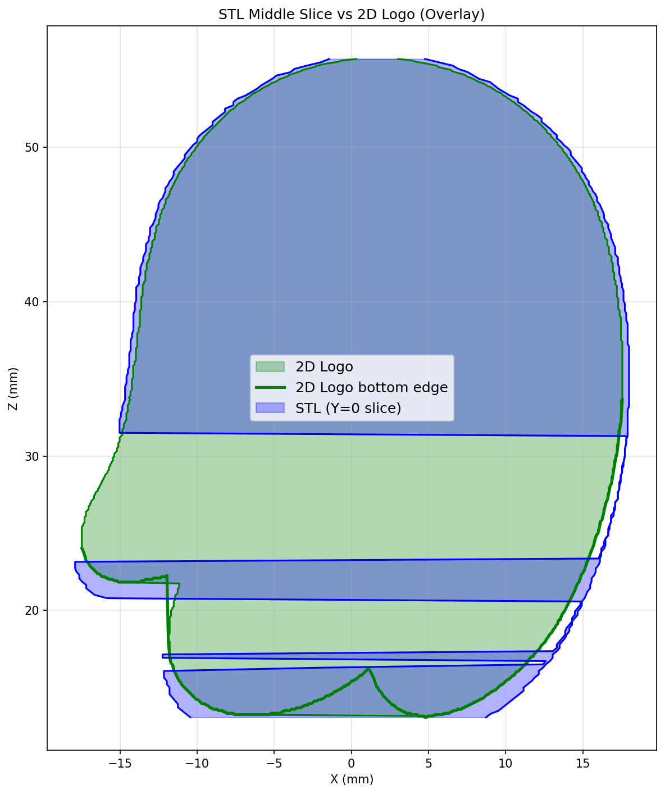
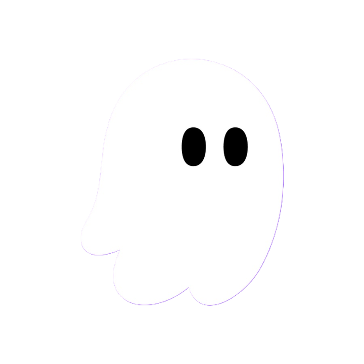
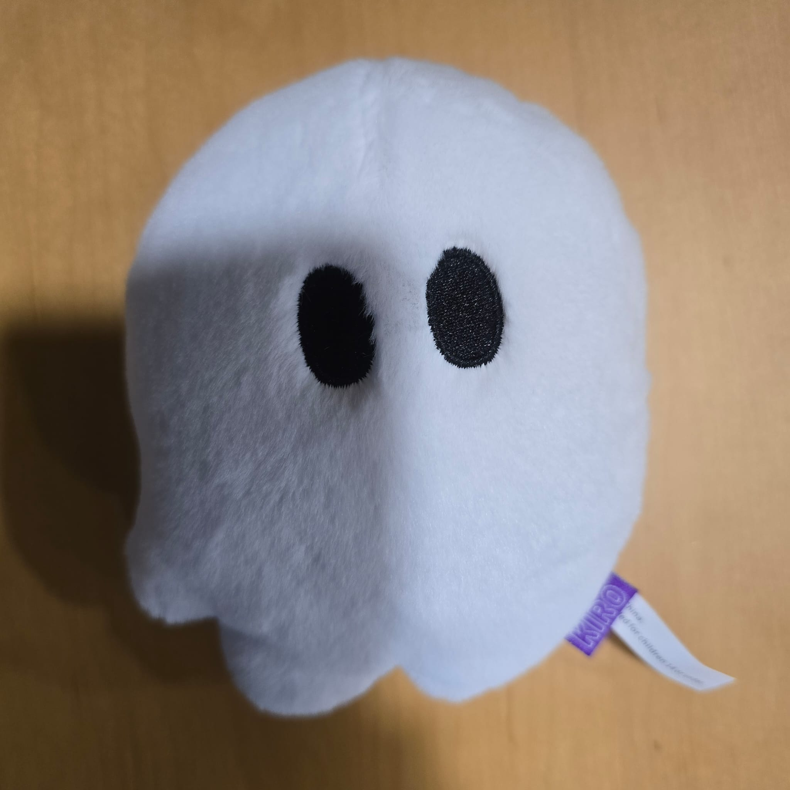
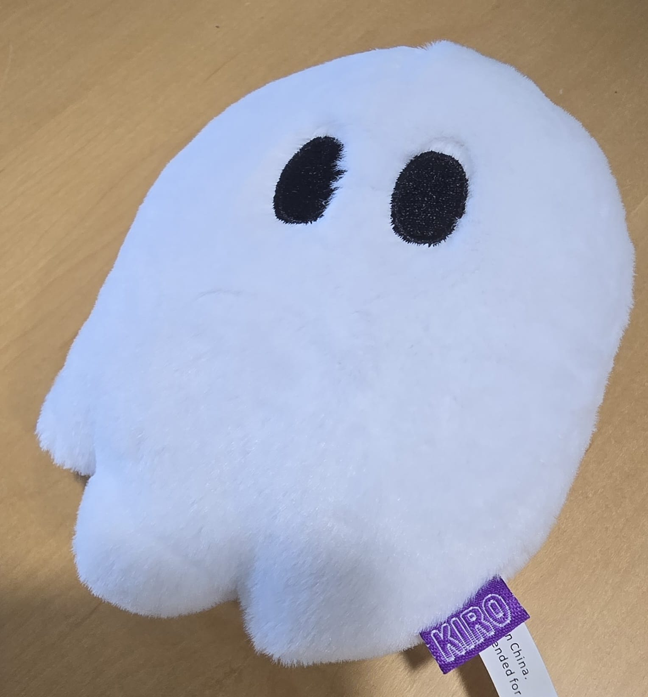
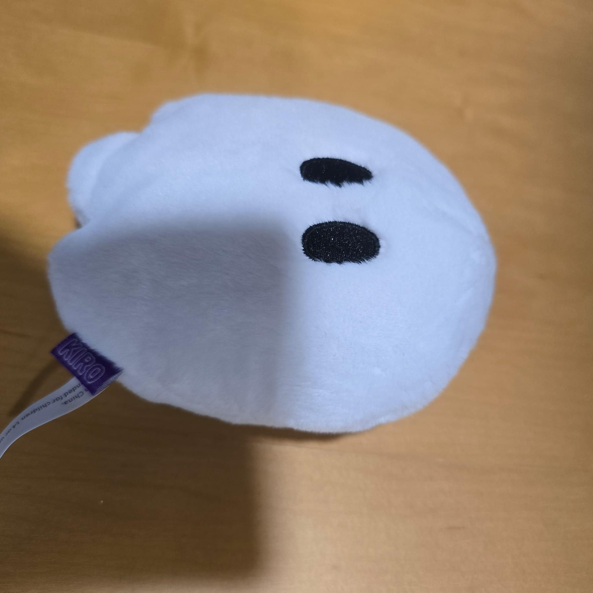
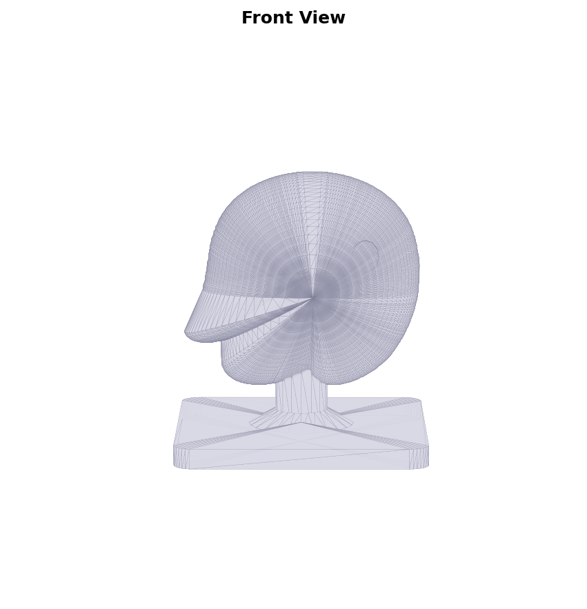
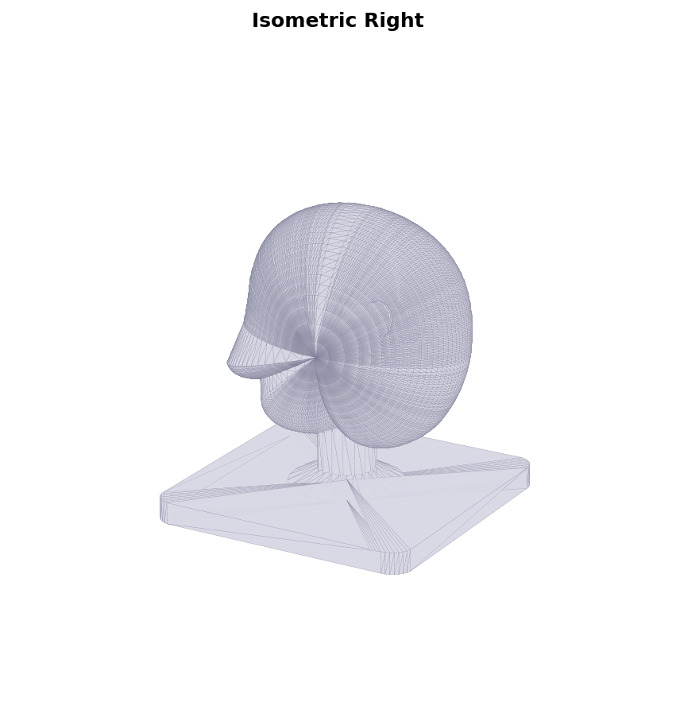
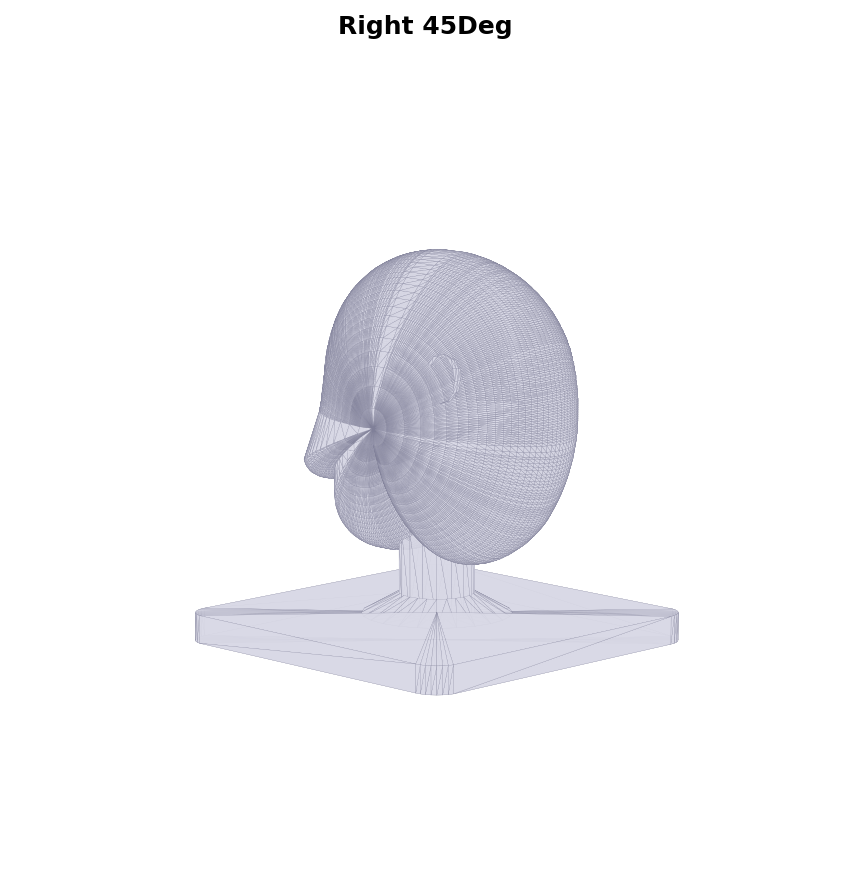

# Building Kiro's 3D Printable STL with Kiro + Vision

This project demonstrates how **Kiro** — with its Vision Language Model (VLM) capabilities — was used to generate a 3D-printable STL file of the Kiro ghost mascot. By uploading reference images directly into the chat, Kiro iteratively designed, validated, and refined the 3D model through a conversational workflow.



## Why This is Interesting

Traditional CAD workflows require specialized software and deep expertise. Here, we used Kiro as an AI-powered design partner that can:

- **See** reference images (2D logos, plushie photos from multiple angles)
- **Generate** Python code that produces 3D geometry (STL files)
- **Render** the STL from multiple viewpoints for visual comparison
- **Iterate** on the design based on visual feedback — all within the same chat session

No CAD software was required. Just images, prompts, and Kiro.

---

## Project Structure

```
kiro_stl/
├── kiro_2D_logo/
│   ├── kiro_2D_logo.jpg                 # Original 2D logo
│   └── kiro_2D_logo_no_background.png   # Logo with transparent background
├── kiro_plushie_images/                  # Reference photos of physical plushie
│   ├── Front_view.jpeg
│   ├── Rear_front_view.jpeg
│   ├── Left_45degrees.jpeg
│   ├── Right_45degrees.jpeg
│   ├── Top_45degrees.jpeg
│   ├── Bottom_45degrees.jpeg
│   ├── isometric_left_view.jpeg
│   └── isometric_right_view.jpeg
├── stl_renders/                          # Multi-angle renders of generated STL
├── trace_logo.py                         # Extracts 2D outline from logo PNG
├── kiro_outline_data.py                  # Auto-generated outline coordinates
├── generate_kiro_ghost.py                # Builds the 3D STL from outline data
├── view_stl.py                           # Renders STL from multiple angles
├── compare_silhouette.py                 # Overlays STL profile vs 2D logo
├── analyze_stl.py                        # Prints geometry stats for debugging
├── kiro_ghost.stl                        # Final 3D-printable STL output
└── silhouette_comparison.png             # Visual comparison result
```

---

## The Workflow: Step by Step

### Step 1: Upload the 2D Logo

**Prompt:**

> Here is the Kiro ghost logo. I want to turn this into a 3D-printable STL figurine — a small desk toy with a base and stand. Can you extract the 2D outline from this image and generate a 3D model?

📎 *Uploaded:* `kiro_2D_logo/kiro_2D_logo_no_background.png`



**What Kiro did:**
- Analyzed the uploaded PNG using the alpha channel to identify the ghost silhouette
- Generated `trace_logo.py` to extract the exact outline (332 coordinate points)
- Detected the eye positions and sizes from black pixel regions
- Saved everything to `kiro_outline_data.py` as reusable data

---

### Step 2: Generate the Initial 3D Model

**Prompt:**

> Great, now inflate this 2D outline into a 3D pillow shape — like a puffy ghost that tapers smoothly at the front and back. Add concave eye indents on the front surface, a cylindrical pillar, and a rounded base plate so it stands up as a desk toy.

**What Kiro did:**
- Created `generate_kiro_ghost.py` which:
  - Inflates the 2D outline into a 3D pillow using sinusoidal scaling across depth slices
  - Creates concave hemispherical eye indentations positioned on the front face
  - Adds a cylindrical support pillar
  - Builds a rounded-corner rectangular base plate
  - Combines all parts and exports `kiro_ghost.stl`

---

### Step 3: Upload Plushie Reference Photos for Comparison

**Prompt:**

> Here are photos of the actual Kiro plushie from 8 angles. Can you render the STL from matching viewpoints so I can compare the shape? The toes at the bottom should have 3 distinct lobes — check if that's coming through in the model.

📎 *Uploaded:* All 8 images from `kiro_plushie_images/`

| Front View | Isometric Right | Right 45° |
|:-:|:-:|:-:|
|  |  |  |

**What Kiro did:**
- Generated `view_stl.py` to render the STL from 10 matching camera angles
- Produced renders in `stl_renders/` for direct visual comparison with the plushie photos

| STL Front | STL Isometric Right | STL Right 45° |
|:-:|:-:|:-:|
|  |  |  |

---

### Step 4: Visual Comparison and Shape Refinement

**Prompt:**

> Comparing the renders, the bottom silhouette doesn't capture all 3 toes — the rightmost concave gap is missing. Can you overlay the STL middle slice against the 2D logo to see where it diverges? The issue might be in how the outline trace handles concave regions.

📎 *Uploaded:* Side-by-side screenshot of plushie vs STL render showing the toe mismatch

**What Kiro did:**
- Generated `compare_silhouette.py` to overlay the STL Y=0 cross-section on top of the 2D logo
- Identified that the original row-scan trace missed concave toe regions
- Rewrote `trace_logo.py` to use a **combined approach**: right edge scan + **column-scan for the bottom edge** + left edge scan
- This captured all 3 toes including the concave rightmost gap
- Re-ran the pipeline to produce an updated `kiro_ghost.stl`

---

### Step 5: Validation

**Prompt:**

> Run the analysis script and show me the final geometry stats. Also regenerate the silhouette comparison to confirm the toes now match.

**What Kiro did:**
- Ran `analyze_stl.py` showing the final dimensions:
  - Width: ~36mm, Height: ~56mm, Depth: ~22mm
- Regenerated `silhouette_comparison.png` confirming all 3 toe lobes are now present
- Final STL is manifold and ready for slicing in any 3D printer slicer (Cura, PrusaSlicer, etc.)

---

## How to Run

### Prerequisites

```bash
pip install numpy numpy-stl Pillow matplotlib
```

### Generate the STL

```bash
# 1. Extract outline from logo (only needed if modifying the trace)
python trace_logo.py

# 2. Generate the 3D STL
python generate_kiro_ghost.py

# 3. Render views for visual comparison
python view_stl.py

# 4. Compare silhouette with 2D logo
python compare_silhouette.py

# 5. Analyze geometry
python analyze_stl.py
```

The output `kiro_ghost.stl` can be loaded directly into any 3D printer slicer.

---

## Key Kiro Capabilities Demonstrated

| Capability | How It Was Used |
|---|---|
| **Vision (VLM)** | Analyzed uploaded logo PNG, plushie photos, and render screenshots to guide design decisions |
| **Image-to-Code** | Extracted precise 2D outline coordinates from a logo image using alpha channel analysis |
| **Iterative Design** | Refined the outline trace algorithm after visual comparison revealed missing concave features |
| **Code Generation** | Produced complete Python scripts for 3D geometry construction, rendering, and validation |
| **Multi-angle Reasoning** | Matched render viewpoints to physical reference photos for accurate shape comparison |
| **3D Geometry** | Generated valid STL meshes with proper face normals, winding order, and manifold topology |

---

## Step 6: Structural Reinforcement

**Prompt:**

> Increase the middle stem by twice the diameter and at the base, please chamfer the stem and the base to strengthen the joint.

**What Kiro did:**
- Doubled the stem diameter from 4mm to **8mm** (radius 2→4mm)
- Added a conical chamfer/fillet at the stem-to-base joint:
  - Flares from the pillar radius (4mm) to 10mm radius at the base plate
  - 4mm tall, providing a smooth load-distributing transition
- This eliminates the sharp 90° junction that's a common failure point in FDM prints

---

## Output

The final `kiro_ghost.stl` (v14) is a ~56mm tall desk figurine featuring:
- Accurate ghost silhouette traced directly from the official Kiro logo
- Smooth pillow-shaped 3D inflation with sinusoidal depth tapering
- Concave eye indentations on the front face
- Three distinct toe lobes at the bottom matching the plushie
- **Doubled-diameter stem** (8mm) with **conical chamfer** for print strength
- Rounded base plate for stability
- Ready to 3D print at 100% scale (no supports needed for FDM with brim)

---

## Takeaway

This project shows that Kiro can function as a **visual design partner** for physical fabrication workflows. By uploading images and iterating through conversation, you can go from a 2D logo to a 3D-printable file without touching CAD software. The VLM capabilities let Kiro "see" what's wrong and fix it — just like a human designer reviewing renders against reference photos.
